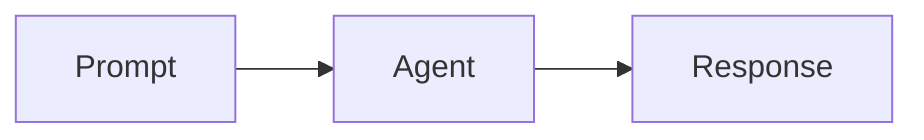

# 006 - Complete Markdown message rendering

- **Status**: DONE
- **Priority**: P0 foundation with phased P1 extensions
- **Surface**: Radius desktop session transcript
- **Current baseline**: `react-markdown`, `remark-gfm`, safe raw-HTML blocking,
  Radius message composition, terminal-table normalization, and shadcn tables

## Problem statement

Radius messages parse CommonMark and GFM, but only a subset has deliberate
product treatment. Several elements render with browser defaults, while
footnotes, math, diagrams, directives, previews, and safe remote media have no
supported rendering contract. This makes otherwise valid agent output look
inconsistent or remain literal source text.

## Goals

1. Every supported Markdown construct has a deliberate Radius component,
   accessible semantics, light/dark treatment, and copy behavior.
2. Unsupported extensions fail visibly and safely rather than disappearing or
   executing arbitrary content.
3. A canonical showcase message exercises every component and remains a stable
   manual and automated regression fixture.
4. Message rendering remains responsive for a 100 KB message, a 1,000-row
   table, and multiple code or diagram blocks without blocking transcript input.
5. Raw HTML, arbitrary scripts, credential-bearing URLs, and unsafe iframe
   embedding remain impossible.

## Non-goals

- Do not enable arbitrary raw HTML or `rehype-raw`.
- Do not make static transcript tables depend on TanStack state unless sorting,
  filtering, pagination, or virtualization is separately requested.
- Do not fetch URLs from the renderer or weaken the renderer CSP.
- Do not execute code blocks or Mermaid click handlers.
- Do not add editing, WYSIWYG, or Markdown source-toggle behavior in this plan.

## User stories

- As a Radius user, I want agent Markdown to render predictably so I can scan a
  response without interpreting source syntax.
- As a technical user, I want readable code, math, diagrams, and tables so I can
  evaluate structured output in place.
- As a keyboard or screen-reader user, I want semantic headings, lists,
  footnotes, task states, and dialog focus restoration.
- As a security-conscious user, I want links and media resolved through bounded
  policies without allowing messages to execute HTML or scripts.

## Phased implementation

### Phase 1 - Complete CommonMark and GFM presentation (P0)

Add explicit message components for:

- `h4`, `h5`, and `h6` with descending regular-weight Radius hierarchy.
- `em`, `del`, and `br`.
- GFM task-list containers, items, and disabled checkbox states.
- Nested ordered/unordered-list rhythm and marker alignment.
- Reference links and autolinks through the existing safe external-link path.

Acceptance criteria:

- No supported CommonMark/GFM element relies on browser default margins,
  weights, colors, or checkbox styling.
- Task checkboxes are non-interactive, announced correctly, and do not show a
  list marker.
- Nested lists remain within the reader measure and do not create horizontal
  scrolling at 320 CSS pixels.

### Phase 2 - Code blocks as a first-class component (P0)

Create `MessageCodeBlock` with:

- Language label when the fence declares one.
- Copy code control with shared copied-state feedback.
- Expand control using the shared near-full-window Dialog pattern.
- Theme-aware syntax highlighting loaded lazily by language.
- Plain-text fallback for unknown languages or highlighter failure.
- Horizontal scrolling, preserved whitespace, and reduced-motion-safe controls.

Implementation constraints:

- Run a bundle/latency spike before selecting the highlighter. Prefer a
  tree-shakable Shiki configuration if initial grammar cost stays bounded.
- Never highlight inline code or execute fenced content.

Acceptance criteria:

- Copy returns the exact source without the language fence.
- A 5,000-line block does not freeze the composer; large blocks may defer or
  virtualize highlighting.
- Expanded view closes with Escape and restores focus to Expand code.

### Phase 3 - Images and safe media (P0/P1)

Create `MessageImage` and a main-process media resolver:

- Preserve local `blob:` and allowed `data:` rendering.
- Resolve remote HTTPS images in the main process with SSRF protection, MIME
  allowlisting, redirect limits, byte limits, timeout, and a bounded cache.
- Render explicit loading, unavailable, and blocked states with alt text.
- Add image expand/zoom without changing the renderer CSP to arbitrary hosts.
- Treat video/audio URLs as links in P0. P1 may add bounded native controls for
  allowlisted media types after the same resolver review.

Acceptance criteria:

- Private-network, loopback, credential-bearing, oversized, non-image, and
  redirect-loop URLs never reach the renderer as media.
- Broken media does not collapse surrounding message layout.

### Phase 4 - Footnotes, citations, and definitions (P1)

Keep the currently parsed footnote baseline and add deliberate components for:

- Footnote references and a message-local footnote section.
- Back-reference navigation with focus and scroll restoration.
- Definition terms and descriptions with compact semantic spacing.
- Citation links as ordinary safe links; source-card enrichment is separate.

Acceptance criteria:

- Footnote IDs are unique per message, even when multiple messages reuse
  `[^1]`.
- Footnote navigation is keyboard-operable and does not change the session URL.

### Phase 5 - Math (P1)

Add inline and block math via `remark-math` plus a non-executing renderer such
as KaTeX:

- Inline math follows text baseline and line height.
- Display math receives horizontal overflow containment.
- Invalid expressions retain readable source and show a quiet error state.
- Math CSS is scoped to message content and both themes.

Acceptance criteria:

- Math rendering introduces no `eval`, remote fonts, or raw HTML execution.
- Copy Markdown retains the original expression.

### Phase 6 - Diagrams (P1)

Create `MessageDiagram` for fenced `mermaid` blocks:

- Parse and render off the critical transcript render path.
- Disable scripts, HTML labels, remote assets, and link callbacks.
- Sanitize generated SVG before insertion.
- Provide source fallback, Copy diagram source, and Expand diagram controls.
- Cap source size, node count, render time, and cached output.

Acceptance criteria:

- A malformed or oversized diagram cannot block the transcript.
- Generated output is inert and keyboard/screen-reader users retain the source
  or an equivalent description.

### Phase 7 - Admonitions and collapsible details (P1)

Use directive syntax rather than raw HTML:

```markdown
:::note Optional title
Body
:::

:::details Summary
Hidden body
:::
```

Map supported directives to shared components:

- `note`, `tip`, `warning`, `important`, and `caution` use a restrained Radius
  callout with semantic labels and one state color.
- `details` uses the native disclosure semantic or shared Collapsible pattern,
  supports Enter/Space/Escape, and honors reduced motion.
- Unknown directives render their source rather than disappearing.

### Phase 8 - Link previews (P1)

Create opt-in previews for standalone HTTPS links:

- Resolve metadata in the main process with the same SSRF/redirect/size limits
  as media.
- Cache normalized title, description, site name, and safe image reference.
- Never send cookies, credentials, local addresses, or referrer data.
- Keep inline links inline; only a paragraph containing a single eligible URL
  may become a preview.
- Provide a plain-link fallback and no automatic iframe/embed behavior.

## Raw HTML policy

Raw HTML remains disabled. Capabilities commonly requested through HTML receive
safe Markdown equivalents:

| Raw request               | Supported equivalent                      |
| ------------------------- | ----------------------------------------- |
| `<details>`               | `:::details` directive                    |
| Styled callout `<div>`    | typed admonition directive                |
| `<iframe>` or video embed | safe link preview or bounded native media |
| `<sup>`/`<sub>` for math  | math syntax                               |
| Arbitrary table HTML      | GFM or normalized terminal table          |

## Architecture

- `MessageMarkdown` remains the parser/composition boundary.
- Each complex block lives in its own memoized component.
- Parser plugins and component maps are module-stable.
- Main-process resolvers own network access and return bounded, credential-free
  data URLs or typed metadata.
- The page continues to own reader/table breakout geometry and tool-panel inset.
- Copy actions use the shared `useCopyFeedback` path.

## Verification strategy

1. Server-render tests for every element and extension.
2. Security tests for raw HTML, unsafe URLs, redirects, media limits, Mermaid
   sanitization, and invalid math.
3. Accessibility tests for semantic roles, labels, task states, footnote focus,
   disclosures, and dialogs.
4. Renderer typecheck, lint, and desktop tests after every phase.
5. Electron visual checks in light and dark themes at normal width and 320 CSS
   pixels.
6. Performance fixtures for long prose, 1,000 table rows, 5,000 code lines,
   multiple diagrams, and repeated streamed updates.

## Success metrics

- 100% of showcase constructs render with intentional components or explicit
  safe fallback.
- Zero raw HTML/script execution paths.
- Zero keyboard traps and full focus restoration from expanded blocks.
- No message-render task over 50 ms for the standard showcase on target desktop
  hardware.
- No initial renderer bundle increase above the agreed post-spike budget.

## Implementation decisions

- Shiki loads dynamically after plain code and skips unknown or oversized
  inputs. Mermaid and DOMPurify are also lazy chunks.
- Media and preview metadata share one main-process transport policy while
  retaining separate bounded LRU result caches.
- Footnotes remain visible and message-local with unique IDs and focus-aware
  references.
- Standalone-link previews require the user to choose Preview link. Radius does
  not contact the destination merely because a transcript contains a URL.

## Canonical showcase seed

Use the following exact Markdown payload as the regression fixture. Unsupported
constructs should remain readable source until their phase lands.

- Seeded on 2026-08-29 in the pinned `testing with tables` session through the
  normal composer/runtime path. The user turn retains the exact fixture and the
  assistant turn provides the current-renderer baseline.

Observed pre-implementation baseline after seeding:

- Already parsed: headings through `h6`, inline emphasis/strong/delete/code,
  links, blockquotes, nested lists, task lists, GFM tables, images, and
  message-local footnotes. These still need the deliberate styling, safety, and
  interaction contracts assigned above.
- Still literal or generic: fenced code controls/highlighting, definition
  lists, math, Mermaid, directives/details, and standalone-link previews.
- Raw HTML is removed rather than executed, as intended.

Implemented result:

- Every planned component now has an intentional renderer or explicit safe
  fallback. The media addendum in the same pinned session verifies a resolved
  remote image and successful user-triggered preview card.
- Desktop node and renderer typechecks passed.
- All 78 desktop tests passed, including Markdown rendering, Mermaid policy,
  media URL rejection, and metadata extraction coverage.
- The production Electron bundle passed; Shiki and Mermaid remained lazy
  chunks.
- Live Electron verification in light and dark themes covered safe GFM, code
  Copy/Expand with focus restoration, math, definitions, footnotes, Mermaid,
  callouts, details, an unavailable-image fallback, a resolved remote image,
  and an explicit link preview card.

````markdown
# Markdown showcase

## CommonMark and GFM

### Heading level three

#### Heading level four

##### Heading level five

###### Heading level six

Plain text with **strong**, _emphasis_, ~~strikethrough~~, `inline code`, an
[external link](https://example.com), and an autolink: https://example.org.

This line ends with a hard break.\
This line follows it.

> A blockquote with **formatted text**.

- Unordered item
  - Nested unordered item

1. Ordered item
   1. Nested ordered item

- [x] Completed task
- [ ] Incomplete task

| Component | State | Notes                     |
| --------- | ----- | ------------------------- |
| Tables    | Ready | shadcn rendering          |
| Code      | Ready | highlighting and controls |

```typescript
type RadiusMarkdown = {
  safe: true;
  components: string[];
};
```


## Scholarly extensions

Footnote reference[^1] and inline math $E = mc^2$.

$$
\int_0^1 x^2\,dx = \frac{1}{3}
$$

Term
: Definition text

[^1]: A message-local footnote with a back-reference.

## Diagrams and directives



:::note Safe callout
Admonition content with **Markdown**.
:::

:::details Expand the details
Hidden Markdown content.
:::

## Raw HTML safety fallback

<details><summary>Raw HTML remains disabled</summary>This must not execute.</details>

Standalone preview candidate:

https://example.com/
````

## Done when

- The canonical fixture is stored once in the pinned session, with its exact
  source preserved in the user turn and its renderer baseline in the assistant
  turn.
- Every phase updates the same fixture expectations rather than creating a new
  ad hoc demo.
- The completed plan remains the implementation and regression record.
